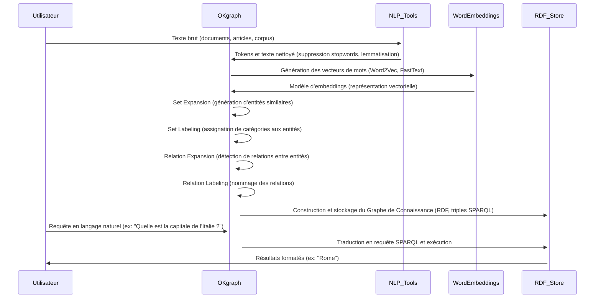
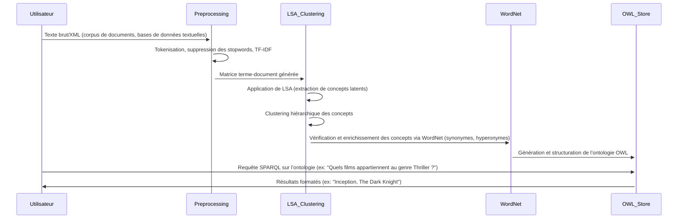

# 📊 Benchmark des Approches Utilisées dans Deux Articles

## 📌 Présentation des Articles

### **Article 1** : *Extracting Data from Text and Querying it via KGQA and BESt Queries* (Université de Cagliari)  
- Propose une approche pour l'extraction d'informations structurées à partir de textes non annotés et l'interrogation de ces données à l'aide de techniques avancées.
- Utilise la bibliothèque **OKgraph** pour extraire automatiquement des **graphes de connaissances (KG)**.
- Introduit des méthodes avancées de requêtage des KG via **Knowledge Graph Question Answering (KGQA)** et **By-Example Structured Queries (BEStQ)**.

### **Article 2** : *Simple Method for Ontology Automatic Extraction from Documents* (Institut Technologique Aéronautique, Brésil)  
- Propose une méthode simple et rapide pour l'extraction automatique d'ontologies à partir de documents.
- Utilise des techniques comme **l’analyse sémantique latente (LSA)**, **le clustering hiérarchique** et **WordNet** pour structurer l’information.
- Génère une **ontologie OWL standardisée** manipulable par des outils d'édition.

---

## 📌 Approches Utilisées pour l'Extraction d'Information

| Critère | Article 1 (OKgraph - KG Extraction) | Article 2 (Extraction Ontologique) |
|---------|-------------------------------------|-------------------------------------|
| **Type d’Information Extraite** | Graphe de connaissances (KG) | Ontologie OWL |
| **Méthodologie Principale** | - Extraction non supervisée basée sur les **word embeddings**. - Exploitation des relations géométriques entre vecteurs. | - **Latent Semantic Analysis (LSA)** pour identifier les concepts. - **Clustering hiérarchique** pour organiser les concepts. - **WordNet** pour enrichir les relations. |
| **Tâches NLP** | - **Set Expansion** : Étendre une liste d’entités (ex: villes d’Italie). - **Set Labeling** : Déterminer la classe d’un ensemble d’entités. - **Relation Expansion** : Trouver des relations implicites entre paires d’entités. - **Relation Labeling** : Identifier la nature des relations entre entités. | - Détection de **concepts-clés** à partir d’un corpus. - Structuration des concepts sous forme de taxonomie. - Génération automatique de **relations sémantiques** grâce à WordNet. |
| **Niveau de Supervision** | Complètement **non supervisé** (aucun besoin d’annotations). | Semi-supervisé (WordNet apporte une base lexicale). |
| **Formats Supportés** | Texte brut uniquement. | Texte brut et **documents XML**. |

### 💡 **Exemple d’Application**
- **Article 1 (OKgraph)** : Si on donne les mots *Milan*, *Rome*, *Bari*, l’algorithme de set expansion pourrait trouver *Turin*, *Venise*, etc.
- **Article 2 (Ontology Extraction)** : À partir d’un corpus de critiques de films, l’algorithme pourrait identifier des concepts comme *Action Movie*, *Crime Thriller*, *Hollywood*, et les organiser sous forme d’une hiérarchie.

---

## 📌 Approches Utilisées pour l’Interrogation des Données

| Critère | Article 1 (KGQA & BEStQ) | Article 2 (OWL Querying) |
|---------|--------------------------|--------------------------|
| **Méthodes de Requête** | - **KGQA (Knowledge Graph Question Answering)** : Traduction d'une question en langage naturel en requête SPARQL. - **BEStQ (By-Example Structured Queries)** : Formulaire de type infobox pour interagir avec le graphe. | - Requêtage des ontologies via des outils standard OWL/SWRL. - Compatibilité avec **Protégé** et autres éditeurs ontologiques. |
| **Modèle d’Utilisation** | Interaction utilisateur via des questions en **langage naturel** ou des formulaires structurés. | Manipulation via des éditeurs ontologiques et des requêtes **SPARQL**. |
| **Cas d’Utilisation** | Recherche intuitive d’informations dans une base de connaissances (ex: "Quelle est la capitale de l'Italie ?"). | Extraction de connaissances structurées pour intégration dans des systèmes experts ou moteurs de recherche. |

### 💡 **Exemple d’Application**
- **Article 1 (KGQA & BEStQ)** : L’utilisateur peut poser la question *"Quels sont les maires des villes en Toscane ?"*, et obtenir une réponse directement.
- **Article 2 (OWL Querying)** : Un expert en ontologies peut interroger une base OWL pour identifier des liens entre concepts.

---

## 📌 Forces et Faiblesses

| Critère | Article 1 (OKgraph - KGQA & BEStQ) | Article 2 (Ontology Extraction) |
|---------|-------------------------------------|-------------------------------------|
| **Forces** | - **Approche totalement non supervisée**. - Permet d’extraire des relations implicites et de répondre en langage naturel. - Intégration avec des **graphes de connaissances** existants. | - Facile à implémenter et adaptable à plusieurs **types de documents**. - Résultat sous format OWL standard, exploitable dans des environnements professionnels. - Exploitation de WordNet pour améliorer la qualité des relations sémantiques. |
| **Faiblesses** | - Fonctionne uniquement sur **texte brut**, pas de support pour XML ou bases de données structurées. - Nécessite un entraînement sur un **large corpus**. | - **Moins interactif**, nécessite des requêtes formelles OWL. - Dépendance à **WordNet**, qui peut ne pas couvrir tous les concepts. |

---

# 📌 Processus Détaillé des Deux Approches avec Exemples Concrets d’Inputs/Outputs
_(D’après les articles fournis)_

---

## 🔷 Article 1 : Extraction et Interrogation de Graphes de Connaissances avec OKgraph

### 🔹 Diagramme de Séquence

---

### 1. Préparation des Données
| **Sous-étape** | **Input** | **Technique / Outil** | **Exemple d’Input** | **Output** | **Exemple d’Output** |
|---------------|----------|----------------|------------------|---------|------------------|
| **1.1 Chargement du Corpus** | Documents texte brut | Python (Pandas, OpenText) | *"Rome est la capitale de l'Italie. Milan est une grande ville."* | Texte chargé | *"Rome est la capitale de l'Italie. Milan est une grande ville."* |
| **1.2 Tokenisation** | Texte brut | `spaCy` / `NLTK` | *"Rome est la capitale de l'Italie."* | Liste de tokens | `["Rome", "est", "la", "capitale", "de", "Italie"]` |
| **1.3 Nettoyage du texte** | Tokens | `re` (expressions régulières) | `["Rome", "est", "la", "capitale", "de", "Italie"]` | Texte pré-traité | `["Rome", "capitale", "Italie"]` |
| **1.4 Normalisation** | Texte nettoyé | Lemmatization (`spaCy`) | `["Rome", "capitale", "Italie"]` | Texte standardisé | `["Rome", "capitale", "Italie"]` |

### 2. Génération des Word Embeddings
| **Sous-étape** | **Input** | **Technique / Outil** | **Exemple d’Input** | **Output** | **Exemple d’Output** |
|---------------|----------|----------------|------------------|---------|------------------|
| **2.1 Création de la matrice de co-occurrence** | Texte normalisé | `Word2Vec`, `FastText` | `["Rome", "capitale", "Italie"]` | Matrice de vecteurs | `{ "Rome": [0.12, 0.45, -0.32], "Italie": [0.14, 0.49, -0.36] }` |
| **2.2 Entraînement du modèle** | Matrice de co-occurrence | `Word2Vec`, `FastText`, `GloVe` | Matrice | Modèle d’embeddings | `word_vectors.kv` |
| **2.3 Stockage des embeddings** | Modèle d’embeddings | `pickle`, `H5Py` | `word_vectors.kv` | Fichier des vecteurs | `embeddings.pkl` |

### 3. Extraction du Graphe de Connaissance avec OKgraph
| **Sous-étape** | **Input** | **Technique / Outil** | **Exemple d’Input** | **Output** | **Exemple d’Output** |
|---------------|----------|----------------|------------------|---------|------------------|
| **3.1 Set Expansion** | Mots-clés | `OKgraph` | `["Rome", "Milan"]` | Liste d’entités similaires | `["Venise", "Naples", "Turin"]` |
| **3.2 Set Labeling** | Liste d’entités | `OKgraph` | `["Rome", "Milan", "Naples"]` | Labels | `["Villes italiennes"]` |
| **3.3 Relation Expansion** | Paires d’entités | `OKgraph` | `[ ("Rome", "Italie") ]` | Relations implicites | `[ ("Naples", "Italie"), ("Turin", "Italie") ]` |
| **3.4 Relation Labeling** | Relations non labellisées | `OKgraph` | `[ ("Rome", "Italie") ]` | Relations labellisées | `[ ("Rome", "capitale de", "Italie") ]` |

---

## 🔷 Article 2 : Extraction Automatique d’Ontologies à partir de Documents

### 🔹 Diagramme de Séquence

---

### 1. Préparation des Documents
| **Sous-étape** | **Input** | **Technique / Outil** | **Exemple d’Input** | **Output** | **Exemple d’Output** |
|---------------|----------|----------------|------------------|---------|------------------|
| **1.1 Chargement des documents** | Fichiers texte / XML | `lxml`, `BeautifulSoup` | `<document>Film: Inception...</document>` | Contenu extrait | `"Film: Inception..."` |

### 2. Extraction des Concepts (LSA)
| **Sous-étape** | **Input** | **Technique / Outil** | **Exemple d’Input** | **Output** | **Exemple d’Output** |
|---------------|----------|----------------|------------------|---------|------------------|
| **2.1 Matrice terme-document** | Texte | `TfidfVectorizer` | `"Film", "Inception", "rêve"` | Matrice sparse | `Matrice TF-IDF` |

### 3. Hiérarchisation des Concepts (Clustering Hiérarchique)
| **Sous-étape** | **Input** | **Technique / Outil** | **Exemple d’Input** | **Output** | **Exemple d’Output** |
|---------------|----------|----------------|------------------|---------|------------------|
| **3.1 Construction de la taxonomie** | Concepts | `AgglomerativeClustering` | `["Film", "Thriller", "Science-fiction"]` | Taxonomie | `{Film -> (Thriller, Science-fiction)}` |

### 6. Interrogation via SPARQL
| **Sous-étape** | **Input** | **Technique / Outil** | **Exemple d’Input** | **Output** | **Exemple d’Output** |
|---------------|----------|----------------|------------------|---------|------------------|
| **6.1 Formulation des requêtes** | Ontologie OWL | `SPARQL Query Builder` | `"SELECT ?x WHERE { ?x type Film }"` | Requête SPARQL | `"SELECT ?x WHERE { ?x type Film }"` |

---

## 📌 Conclusion et Recommandation

Les deux articles proposent des approches efficaces mais avec des objectifs différents :

- **Si l’objectif est d’extraire et d’interroger des connaissances sous forme de graphes de connaissances**, alors **l’approche OKgraph (Article 1)** est idéale, surtout si l'on veut **interagir en langage naturel**.
- **Si l’objectif est de construire des ontologies exploitables dans un système expert ou via OWL**, alors **l’approche basée sur LSA, clustering et WordNet (Article 2)** est plus appropriée.

### 🚀 **Recommandation**
- **Pour des applications orientées grand public** (ex: assistants IA, moteurs de réponse en langage naturel), privilégier **OKgraph et KGQA**.
- **Pour des applications orientées entreprise ou domaine spécifique** (ex: systèmes de gestion des connaissances, recherche sémantique avancée), privilégier **l’extraction ontologique via LSA et clustering**.

---

## 🎯 **Prochaines Étapes**
- **Tester l'intégration de OKgraph avec une base de données** pour voir sa robustesse.
- **Comparer les performances des requêtes SPARQL vs OWL** sur un même ensemble de données.
- **Explorer d'autres ontologies de référence** pour améliorer la qualité des relations extraites.

---

## 🔗 **Références**
- **[OKgraph Library](https://github.com/atzori/okgraph)**
- **[WordNet Project](https://wordnet.princeton.edu/)**
- **[Protégé - OWL Editor](https://protege.stanford.edu/)**

